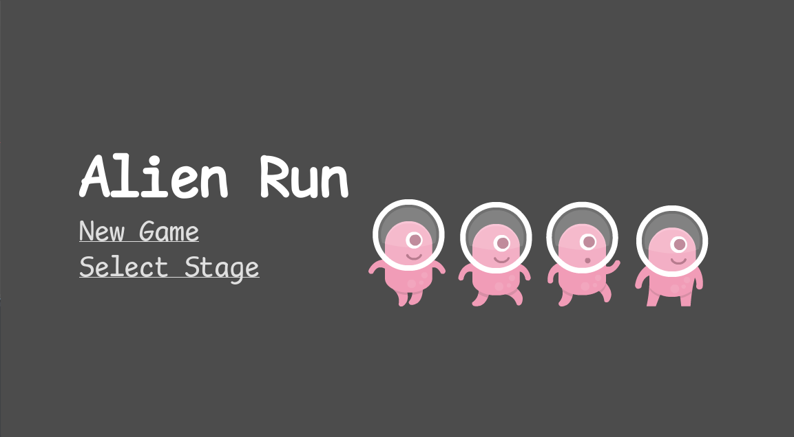
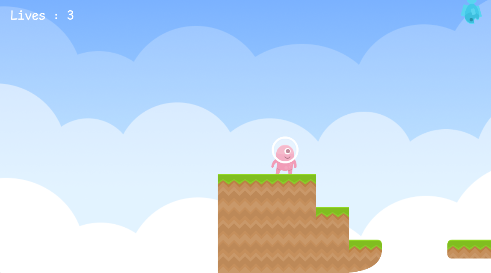
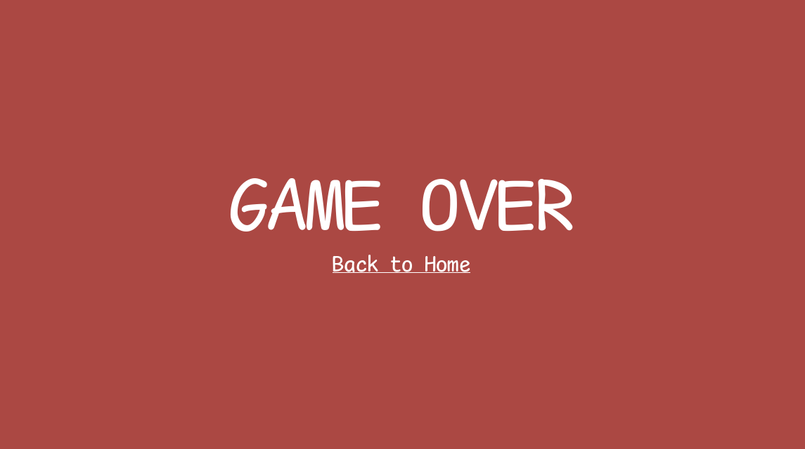
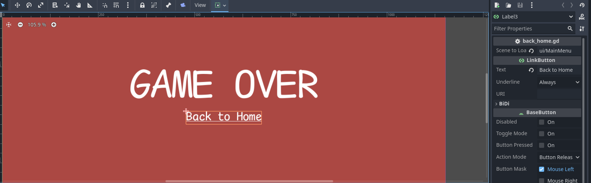
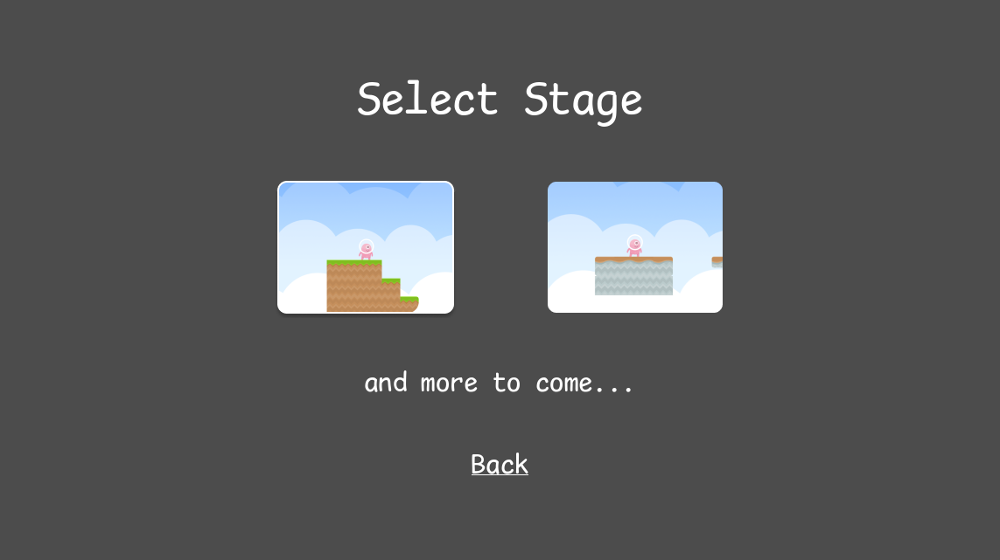
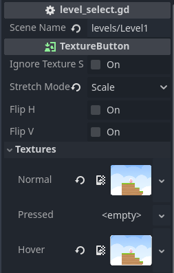

# Tutorial 4

For this tutorial's latihan mandiri, I created a level with a different tilemap, which is the stone tilemap as opposed to the ground used in the tutorial.

I found it a bit annoying that I had to jump over the falling fish with limited space on the ground with no double jump, so I adjusted the collision layer and mask for the player, the platform, and the obstacle (fish in level 1 and barnacle in level 2) so that the player could collide with both the platform and the fish, but the fish would just pass through the platform.

| Scene | Collision Layer | Collision Mask |
|--- |--- | --- |
|Player | 1 | 1, 2 |
|TileMapLayer | 1 | 1 |
| FishFall/NewObstacle | 2 | 2 |

I also edited the WinScreen and the LoseScreen so that it would be clickable. If you got the WinScreen from level 1, clicking it would lead you to level 2. If you got the LoseScreen, you could click it to restart your level. I'm not sure my way of doing it is the most sophisticated way (using a TextureButton), but it works for now and I hope to explore with it more in the future since I've been meaning to implement this since the second tutorial (first Godot tutorial).

Similarly, I added a background by attaching a Sprite2D node to my Camera which I also implemented in the previous tutorial. 

## References
Collision layers and masks: https://forum.godotengine.org/t/collisions-layers-masks/66193

# Tutorial 6
1. Main Menu 
 
I made a main menu following the instructions in the tutorial. The font used is Comic Mono, a font I've been using in my code editors since I was a freshman.
2. Life Counter 
 
A life counter to add an extra layer of challenge for our player, once again just following the tutorial.
3. Game Over Screen 
 
A game over screen for when the player loses all three of its lives, as per the tutorial. For the latihan mandiri, I implemented a button that takes it back to the main menu. It's just a linkbutton that links you to the MainMenu scene. 
 
4. Select Stage 
 
I made a select stage page with TextureButton buttons for each level. There's a hover variant with an outline too. I simply added a TextureButton, assigned a texture for its default state and hover state, and attached a script to the button that allows it to move to the selected level. 
 

# Tutorial 8
Apart from the instructions in the tutorial, I just changed the color of the rain particles in the first level and made the particles look like white snow in the second level. Also, I had to resize the trail particles (I don't think this was included in the tutorial) to around 0.3 in Scale because the original texture of the brick was much too big. 

Since I used my tutorial 6 instead of using the tutorial 8 template, I adjusted my own spawner. I added @export SpawnTime : int = 2 to the spawner script (so it can be adjusted quickly from the scene if I wanted to) and I slowed down the speed of the object's (fish) fall. I found that this made playing the game feel more balanced and less frustrating because previously, it just felt like the fish fell on me out of nowhere and I had no time to dodge it. 
